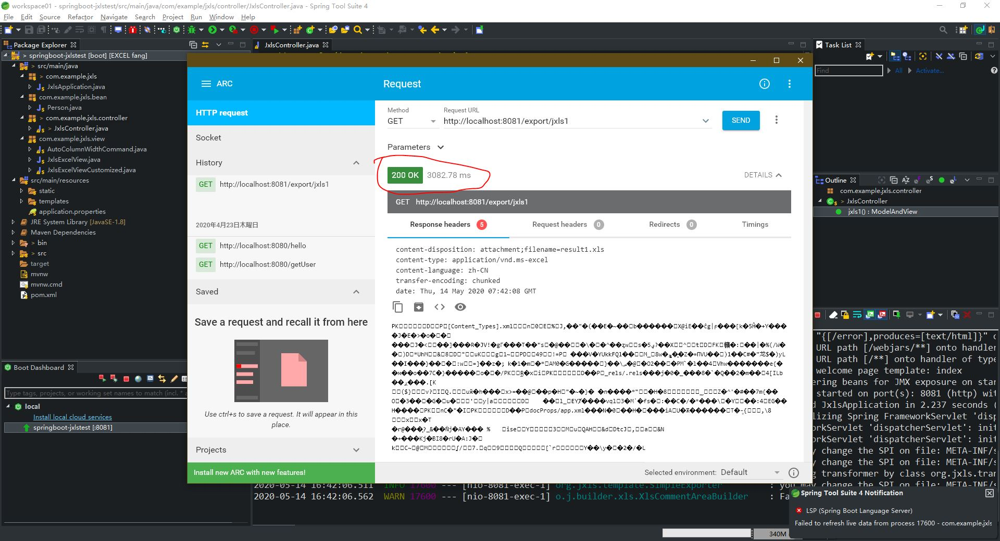
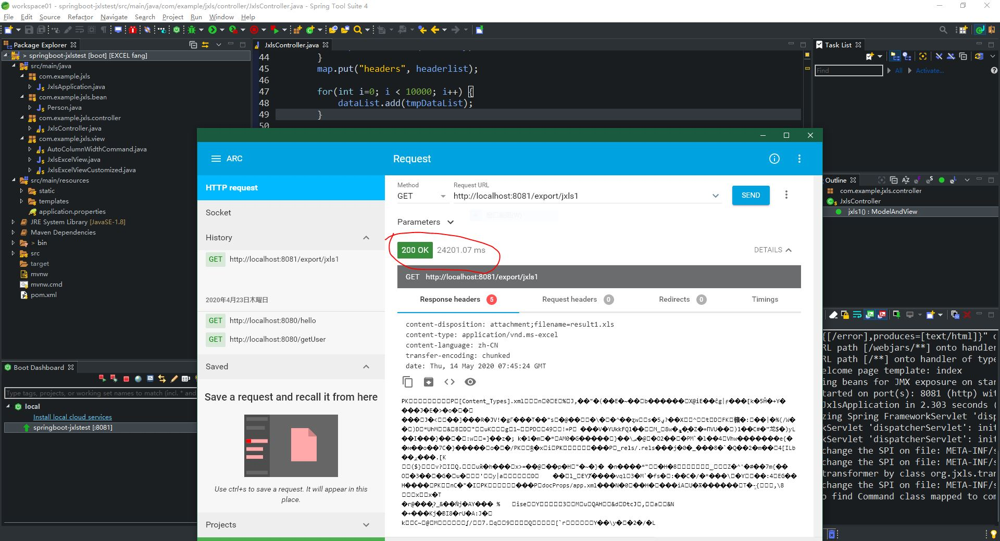

## JXLSテスト結果  
データが多くなると、けっこ遅くなりますが。
実装方法とソースの書き方、そしてテスト環境が結果に影響があると思いますが。

### 列数：３０　行数：１０００　
- 処理時間 : ３秒ぐらい  
- テスト画面イメージ  

      
- ダウンロードファイル  
[result_30x1000.xlsx](./result/result_30x1000.xlsx)

### 列数：３０　行数：１００００　
- 処理時間 : ２３秒ぐらい  
- テスト画面イメージ  

      
- ダウンロードファイル  
[result_30x1000.xlsx](./result/result_30x10000.xlsx)

## ソース
[https://github.com/lawrence-5/EXCEL](https://github.com/lawrence-5/EXCEL)  
