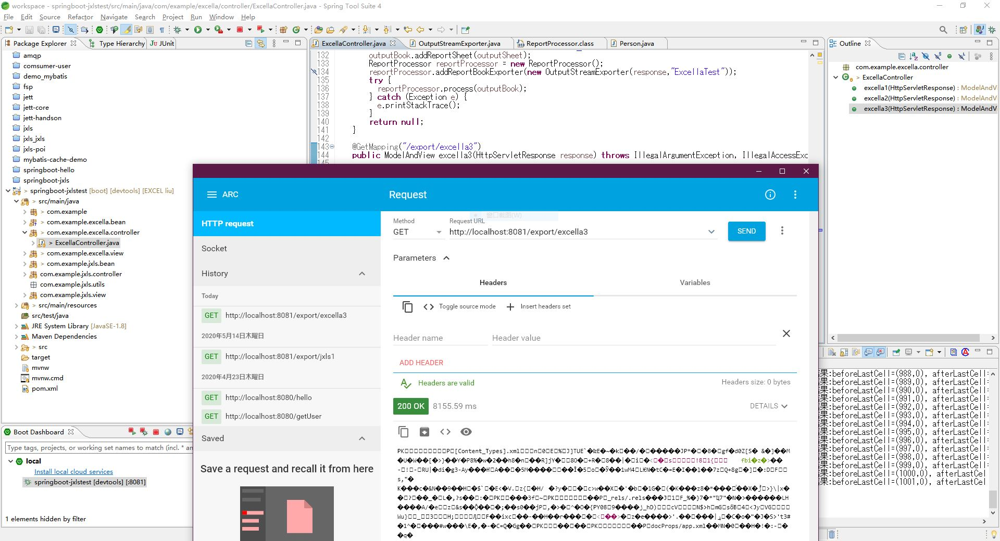
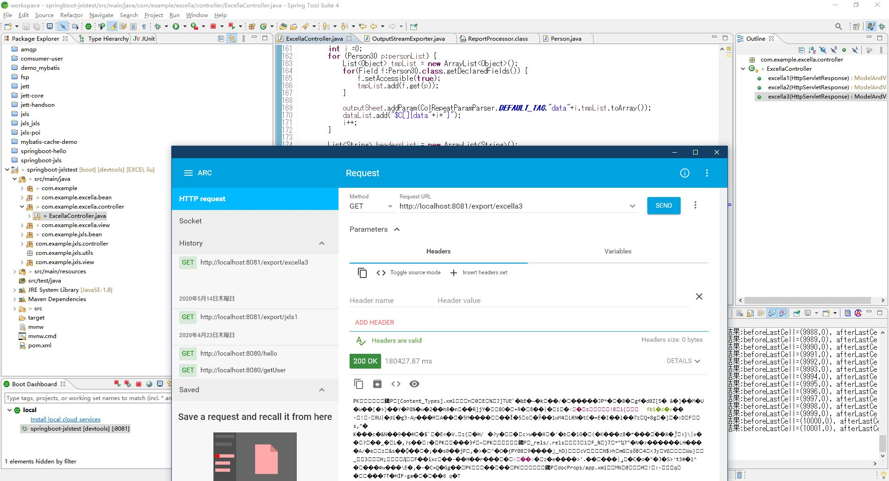

## EXCELLAテスト結果  
データが多くなると、けっこう遅くなりますが。
実装方法とソースの書き方、そしてテスト環境が結果に影響があると思いますが。  

**EXCELLAの処理の中に、渡されたデータの内容のセルごとに、複雑な処理をおこなうそうですから、大変遅くなります。**  

### 列数：３０　行数：１０００　
- 処理時間 : ８秒ぐらい  
- テスト画面イメージ  

      
- ダウンロードファイル  
[ExcellaTest_30x1000.xlsx](./result_excella/ExcellaTest_30x1000.xlsx)

### 列数：３０　行数：１００００　
- 処理時間 : １８０秒ぐらい  
- テスト画面イメージ  

      
- ダウンロードファイル  
[ExcellaTest_30x10000.xlsx](./result_excella/ExcellaTest_30x10000.xlsx)
